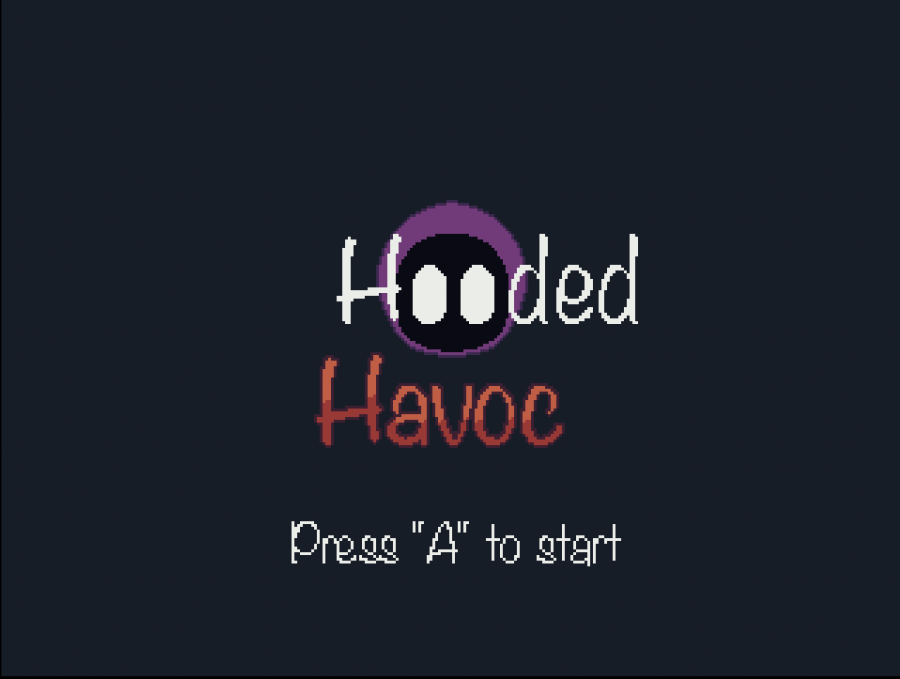
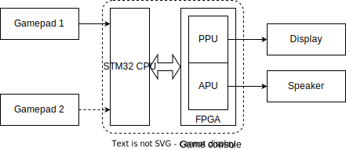
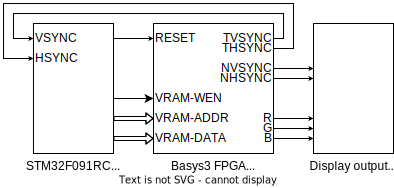
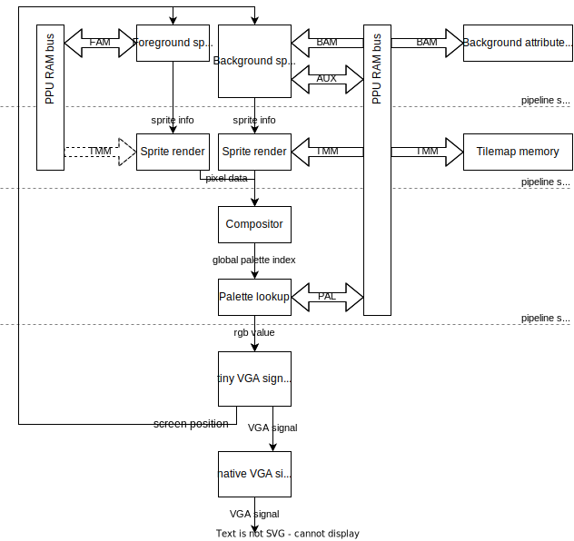
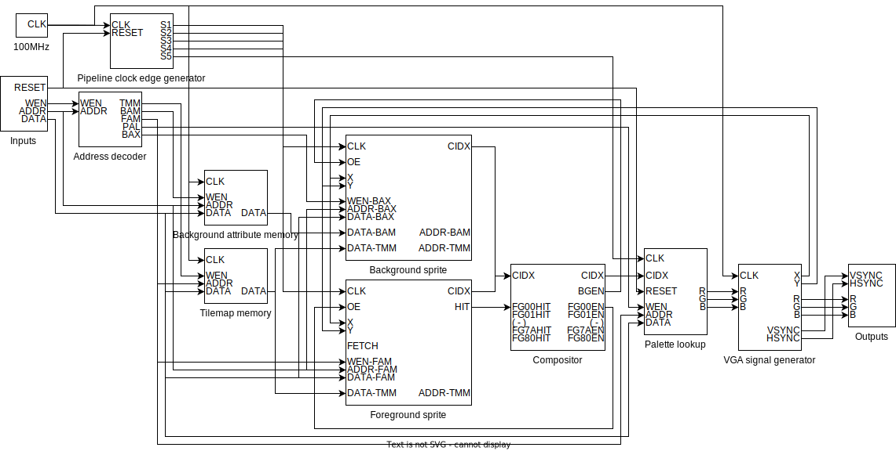

# Hooded Havic: Miniboss Mania


# introduction
Welcome to Hooded Havoc: Miniboss Mania, an exciting 2D platformer game created by our team Joshua, Loek, Bjorn, Frenk and Niels! This game was developed using the STM32 microcontroller as the game engine and the FPGA as the Picture Processing Unit (PPU).

In Hooded Havoc: Miniboss Mania, you will take on the role of a brave hero who must battle through multiple levels filled with challenging obstacles and formidable minibosses. With smooth gameplay and engaging graphics, you will feel immersed in a world of adventure and excitement.

Our use of the STM32 microcontroller and FPGA PPU allowed us to create a unique and innovative gaming experience. The STM32 provides efficient and reliable processing power, while the FPGA ensures that our graphics are rendered smoothly and accurately.

So get ready to embark on a thrilling journey through Hooded Havoc: Miniboss Mania, and see how far you can make it!
## Objective
The objective of Hooded Havoc: Miniboss Mania is to guide the hero through multiple levels, defeating minibosses and overcoming obstacles along the way. The ultimate goal is to reach the final boss and defeat them to retrieve the stolen staff.

To achieve this objective, the player must use their platforming skills to jump, run, and dodge obstacles while also battling enemies and minibosses. Each level presents a unique challenge that will require the player to adapt and strategize to overcome.

As the player progresses through the game, they will unlock new abilities and power-ups that will aid them in their journey. The player must use these abilities wisely to defeat the minibosses and ultimately save the world.

So, the objective of Hooded Havoc: Miniboss Mania is not only to provide an exciting and engaging gaming experience but also to challenge players to use their skills and strategic thinking to overcome obstacles and emerge victorious.
## Problem statement
One potential problem that could arise in the development of Hooded Havoc: Miniboss Mania is related to the PPU and communication between the STM32 and PPU.

The PPU is responsible for rendering the graphics and displaying them on the screen, while the STM32 is responsible for processing the game logic and input from the player. However, if there is a problem with the communication between these two components, it could lead to synchronization issues and graphical glitches that could affect the player's experience.

For example, if the PPU is unable to keep up with the processing speed of the STM32, the graphics may lag or appear distorted, causing the game to become unplayable. Similarly, if there is a delay in communication between the STM32 and PPU, it could result in a mismatch between the game logic and the displayed graphics, leading to confusion for the player.

To ensure a smooth and enjoyable gaming experience, it is essential to address any potential issues with the PPU and communication between the STM32 and PPU during the development process. This may involve optimizing the code for both components, adjusting the communication protocol, or adding buffer systems to prevent lag or synchronization issues.
### architecture ( top level)
;


### design document (mid-low level)

# General system architecture



Important notes:

- Gamepad 2 is optionally connected
- The PPU and APU are implemented on the FPGA
- The game logic and PPU/APU control logic runs on the STM32 only

# Game controllers

## Input

The playable character has 4 actions that it can perform:

- horizontal movement
- aiming
- jump 
- ability / use

To perform these action there will be 6 buttons for the user to use.

A joystick is not needed for the movement because the movement is not complex, so button fulfill this. 
The layout will be as follows:
 


## Input handling

The hardware consist out of a microcontroller and a FPGA.
The microcontroller will process the game logic.
For this reason the input will be handled by the microcontroller as this will improve playability (stated in research).

The controller will have six buttons, so six data pins are needed on the microcontroller plus a ground and 3.3V or 5V pin.
In total there are eight pins needed. 
If the game is going to be played by 2 persons, there are six more data pins needed so 8 data pins for both controllers.
For data transfer between STM32 and FPGA there are 4 pins needed at maximum (SPI for instance). 
The STM32 will be used and most STM32 boards have enough I/O pins for our needs. 
The STM32 F030 and F091 provided by Avans both have 15 digital pins and 6 analog pins.
The buttons will be connected as follows:


To implement the input in the game, the input should be checked at the start of each game cycle. In this case there are no interrupts needed.

# STM32 software

The game engine will be designed to support 2D games. The engine will use a state machine to manage game states and transitions between them. The state machine will be implemented using a finite state machine (FSM) design pattern. The engine will also include support for handling user input, game logic, and sound.

FSM is a useful tool for managing game states and transitions. A game can have many different states, such as a title screen, a level selection screen, a loading screen, and various gameplay states. Each state represents a particular configuration of the game, with different sets of variables, objects, and logic

The state machine will be designed with the following states:

1. Initialization: The initialization state will be responsible for initializing all game-related variables and subsystems, including the FPGA-based picture processing unit.
2. Title Screen: The title screen state will display the game's title screen and wait for user input to start the game or access the options menu.
3. Options: The options state will allow the user to configure game settings, such as sound and graphics options.
4. Game Play: The game play state will be responsible for running the game logic and updating the game state.
5. Game Over: The game over state will display the game over screen and wait for user input to restart the game or return to the title screen.

# PPU

Here's a list of features our PPU has:

- 320x240 @ 60Hz VGA output (upscaled to 640x480)
- single tilemap with room for 1024 tiles of 16x16 pixels
- 8 colors per palette, with 4096 possible colors (12-bit color depth)
- 640x480 background canvas with scrolling
- NO background scrolling splits
- 128 total sprites on screen (NO scanline sprite limit)
- sprites are always drawn on top of the background layer
- PPU control using DMA (dual-port asynchronous RAM)
- tiles can be flipped using FAM or BAM
- no frame buffer
- vertical and horizontal sync and blank output

Notable differences:

- NES nametable equivalent is called BAM (background attribute register)
- NES OAM equivalent is called FAM (foreground attribute register)
- 320x240 @ 60Hz output
  
  Since we're using VGA, we can't use custom resolutions without an
  upscaler/downscaler. This resolution was chosen because it's exactly half of
  the lowest standard VGA resolution 640x480.
- No scanline sprite limit  
  
  Unless not imposing any sprite limit makes the hardware implementation
  impossible, or much more difficult, this is a restriction that will likely
  lead to frustrating debugging sessions, so will not be replicated in our
  custom PPU.
- Sprites are 16x16
  
  Most NES games already tile multiple 8x8 tiles together into "metatiles" to
  create the illusion of larger sprites. This was likely done to save on memory
  costs as RAM was expensive in the '80s, but since we're running on an FPGA
  cost is irrelevant.
- Single 1024 sprite tilemap shared between foreground and background sprites
  
  The NES OAM registers contain a bit to select which tilemap to use (of two),
  which effectively expands each tile's index address by one byte. Instead of
  creating the illusion of two separate memory areas for tiles, having one
  large tilemap seems like a more sensible solution to indexed tiles.
- 8 total palettes, with 8 colors each
  
  More colors is better. Increasing the total palette count is a very memory
  intensive operation, while increasing the palette color count is likely slower
  when looking up color values for each pixel on real hardware.
- Sprites can be positioned partially off-screen on all screen edges using only
  the offset bits in the FAM register
  
  The NES has a separate PPUMASK register to control special color effects, and
  to shift sprites off the left and top screen edges, as the sprite offsets
  count from 0. Our PPU's FAM sprite offset bits count from -15, so the sprite
  can shift past the top and left screen edges, as well as the standard bottom
  and right edges.
- No status line register, only V-sync and H-sync outputs are supplied back to
  CPU
  
  The NES status line register contains some handy lines, such as a buggy
  status line for reaching the max sprite count per scanline, and a status line
  for detecting collisions between background and foreground sprites. Our PPU
  doesn't have a scanline limit, and all hitbox detection is done in software.
  Software hacks involving swapping tiles during a screen draw cycle can still
  be achieved by counting the V-sync and H-sync pulses using interrupts.
- No background scrolling splits
  
  This feature allows only part of the background canvas to be scrolled, while
  another portion stays still. This was used to draw HUD elements on the
  background layer for displaying things like health bars or score counters.
  Since we are working with a higher foreground sprite limit, we'll use regular
  foreground sprites to display HUD elements.
- Sprites are always drawn on top of the background layer
  
  Our game doesn't need this capability for any visual effects. Leaving this
  feature out will lead to a simpler hardware design
- Sprites are positioned relative to the viewport, not the background layer
  
  This leads to a simpler hardware architecture for the foreground sprite
  rendering component. Since the CPU is already likely to reposition all
  foreground sprites on every frame, the position calculation is moved to
  hardware to software.

## Hardware design schematics

### Top (level 1)



Important notes:

- The STM32 can reset the PPU. This line will also be connected to a physical
  button on the FPGA.
- The STM32 uses direct memory access to control the PPU.
- The PPU's native resolution is 320x240. It works in this resolution as if it
  is a valid VGA signal. The STM32 is also only aware of this resolution. This
  resolution is referred to as "tiny" resolution. Because VGA-compatible LCD's
  likely don't support this resolution due to low clock speed, a built-in
  pixel-perfect 2X upscaler is chained after the PPU's "tiny" output. This
  means that the display sees the resolution as 640x480, but the PPU and STM32
  only work in 320x240.
- The STM32 receives the TVSYNC and THSYNC lines from the PPU. These are the
  VSYNC and HSYNC lines from the tiny VGA signal generator. These lines can be
  used to trigger interrupts for counting frames, and to make sure no
  read/write conflicts occur for protected memory regions in the PPU.
- NVSYNC, NHSYNC and the RGB signals refer to the output of the native VGA
  signal generator.

### Level 2



Important notes:

- The pixel fetch logic is pipelined in 5 stages:
  1. - (Foreground sprite info) calculate if foreground sprite exists at
     current pixel using FAM register
     - (Background sprite info) get background sprite info from BAM register
  2. - (Sprite render) calculate pixel to read from TMM based on sprite info
  3. - (Compositor) get pixel with 'highest' priority (pick first foreground
     sprite with non-transparent color at current pixel in order, fallback to
     background)
     - (Palette lookup) lookup palette color using palette register
     - (VGA signal generator) output real color to VGA signal generator
- The pipeline stages with two clock cycles contain an address set and memory
  read step.
- The pipeline takes 5 clock ticks in total. About 18 are available during each
  pixel. For optimal display compatibility, the output color signal should be
  stable before 50% of the pixel clock pulse width (9 clock ticks).
- Since the "sprite info" and "sprite render" steps are fundamentally different
  for the foreground and background layer, these components will be combined
  into one for each layer respectively. They are separated in the above diagram
  for pipeline stage illustration.
- The AUX, FAM, and PAL registers are implemented in the component that
  directly accesses them, but are exposed to the PPU RAM bus for writing.
- Each foreground sprite render component holds its own sprite data copy from
  the RAM in it's own cache memory. The cache updates are fetched during the
  VBLANK time between each frame.

### Level 3

This diagram has several flaws, but a significant amount of time has already
been spent on these, so they are highlighted here instead of being fixed.



Flaws:

- Pipeline stages 1-4 aren't properly connected in this diagram, see level 2
  notes for proper functionality
- The global RESET input resets all PPU RAM, but isn't connected to all RAM
  ports
- All DATA inputs on the same line as an ADDR output are connections to a
  memory component. Not all of these are connected in the diagram, though they
  should be.
- All ADDR and ADDR drivers are also tri-state. EN inputs need to be added to
  support switching the output on/off.

Important notes:

- The background sprite and foreground sprite component internally share some
  components for coordinate transformations
- The foreground sprite component is only shown once here, but is cloned for
  each foreground sprite the PPU allows.
- The CIDX lines between the sprite and compositor components is shared by all
  sprite components, and is such tri-state. A single sprite component outputs a
  CIDX signal based on the EN signal from the compositor.
- All DATA and ADDR lines are shared between all RAM ports. WEN inputs are
  controlled by the address decoder.

## Registers

- The PPU's memory bus has 16-bit addresses and 16-bit words.
- Some memory regions use physical word sizes smaller than 16-bits, so
  "unneeded" bits will be discarded by the PPU.
- Apparent size means the amount of addresses in a given memory region. As
  mentioned earlier, the exact word sizes of a memory area can vary, though
  this is not visible to the CPU as all data is presented as 16-bit words.

|Address offset|Apparent size|Alias|Description|
|-|-|-|-|
|`0x0000`|`0xd000`|TMM  |[tilemap memory][TMM]|
|`0xd000`|`0x04b0`|BAM  |[background attribute memory][BAM]|
|`0xd800`|`0x0100`|FAM  |[foreground attribute memory][FAM]|
|`0xdc00`|`0x0040`|PAL  |[palettes][PAL]|
|`0xde00`|`0x0002`|AUX  |[auxiliary memory][AUX]|

This table contains the "official" PPU register offsets and sizes. Due to the
way the address decoder works, some of these memory regions might be duplicated
in the address ranges between the memory regions. This is considered undefined
behavior, so the CPU should not attempt to write in these locations because
there is no address validity checking.

[TMM]: #tilemap-memory
### Tilemap memory

- Each sprite takes up 768 bits spread across 52 15-bit words (with one
  discarded padding bit per word)
- Pixel index order is from top-left to bottom-right in (English) reading
  order.
- Bits `14 downto 3` of the byte with the highest address for a given tile are
  not used
- To calculate TMM address $a$ for any given pixel $p$ of tile with index $t$,
  compute $a=52*t+\left\lfloor\frac{p}{5}\right\rfloor$

Word format:

|Range (VHDL)|Description|
|-|-|
|`15`|(discarded)|
|`14 downto 12`|pixel $n+4$|
|`11 downto 9`|pixel $n+3$|
|`8 downto 6`|pixel $n+2$|
|`5 downto 3`|pixel $n+1$|
|`2 downto 0`|pixel $n+0$|


[BAM]: #background-attribute-memory
### Background attribute memory

- 15-bit words (MSB discarded in hardware)
- Address indicates which background sprite is currently targeted in reading
  order  
  e.g. $\textrm{addr} = c000_{\textrm{hex}} + x + y*w$ where $x$ and $y$
  are the background tile, and $w$ is the amount of horizontal tiles fit on the
  background layer (40)

Word format:

|Range (VHDL)|Description|
|-|-|
|`15`|(discarded)|
|`14`|Flip horizontally|
|`13`|Flip vertically|
|`12 downto 10`|Palette index for tile|
|`9 downto 0`|Tilemap index|

[FAM]: #foreground-attribute-memory
### Foreground attribute memory

- 32-bit words
- Sprites with lower addresses are drawn "before" sprites with higher addresses

Word format:

|Range (VHDL)|Description|
|-|-|
|`31`|Flip horizontally|
|`30`|Flip vertically|
|`29 downto 21`|horizontal position (offset by -16)|
|`20 downto 13`|vertical position (offset by -16)|
|`12 downto 10`|Palette index for tile|
|`9 downto 0`|Tilemap index|

[PAL]: #palettes
### Palettes

- 12-bit words (4 MSB discarded in hardware)
- Address formula for palette color is $p_i*8 + p_c$ where $p_i$ is the palette
  index and $p_c$ is the color index within a given palette.

Word format:

|Range (VHDL)|Description|
|-|-|
|`15 downto 12`|(discarded)|
|`11 downto 8`|Red value|
|`7 downto 4`|Green value|
|`3 downto 0`|Blue value|

[AUX]: #auxiliary-memory
### Auxiliary memory

- no words

Format:

|Range (VHDL)|Description|
|-|-|
|`31 downto 18`|(unused)|
|`17`|Fetch foreground sprites flag|
|`16 downto 8`|Horizontal background scroll (offset from left edge)|
|`7 downto 0`|Vertical background scroll (offset from top edge)|

[custompputimings]: https://docs.google.com/spreadsheets/d/1MU6K4c4PtMR_JXIpc3I0ZJdLZNnoFO7G2P3olCz6LSc

# APU

The Audio Processing Unit (APU) is programmed on the FPGA, here it will produce different signals on the audio output. These signals come in a few forms, as listed below.

- triangle waves
- square waves
- sine waves
- sawtooth waves
- random noise 

These signals will be generated using PWM, this allows a digital signal to act as an analog signal. Using this method it is theoretically possible to create all of the aforementioned signals.


This figure shows an example signal (in blue), created by the FPGA. and the corresponding analog signal (in red).

In order to generate a audio signal from a note, we need a few things:

- frequency
- duration
- amplitude

optional:

- envelope (ADSR)


This image shows an advanced method of generating tones. In our case this is only an indication as to how it could be done, we will actually only be looking at the sustained tone part for simplicity sakes.
In order to get the correct graph forms, some data points can be stored in a LUT (Look Up Table). This allows the saving of computation power at the cost of some ROM space.
This only creates one type of sound at a set frequency and amplitude. The frequency of this tone can be altered by increasing the step size of the LUT. This allows the creation of higher frequency signals at a slight loss of precision.
The following pseudo code is there to show an example of this:
```c
for (i = 0; i < toneLength; i++){
  for (k = 0; k < sizeof(LUT); k += stepSize){
    OUT = LUT[k];
  }
}
```
This output can then be converted to a PWM signal using known methods or existing solutions as described in the beginning of this chapter.

# Level design

To create sprites the program to be used is aseprite, aseprite exports their
sprite palette and puts them in our 2d map editor. For creating 2d levels were
using Tiled as our 2d map editor. With this software, we can create and export
our maps with our preferred technique. Indexed tilemaps are the technique we’re
using to export our levels from the microcontroller to the FPGA.


To index tiles from the tilemap, 10 bits will be used for both the foreground
and background layers of the PPU. This means that the global tilemap can fit up
to 1024 tiles in total, each being 16x16 pixels (the example uses 4x4 tiles for
illustration purposes).
