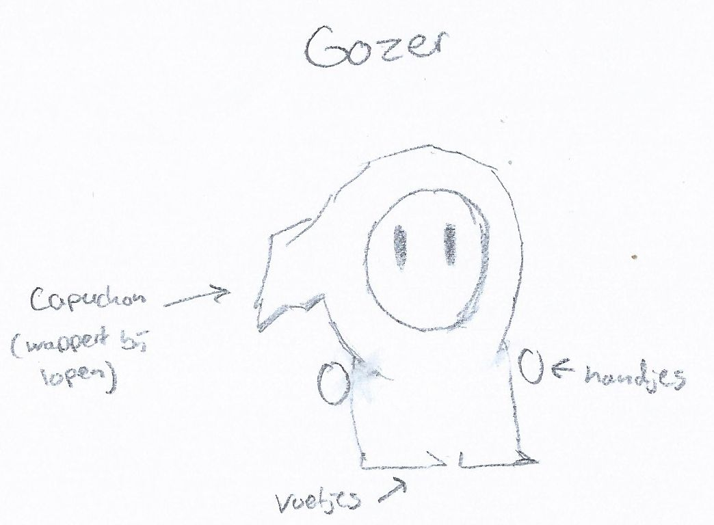
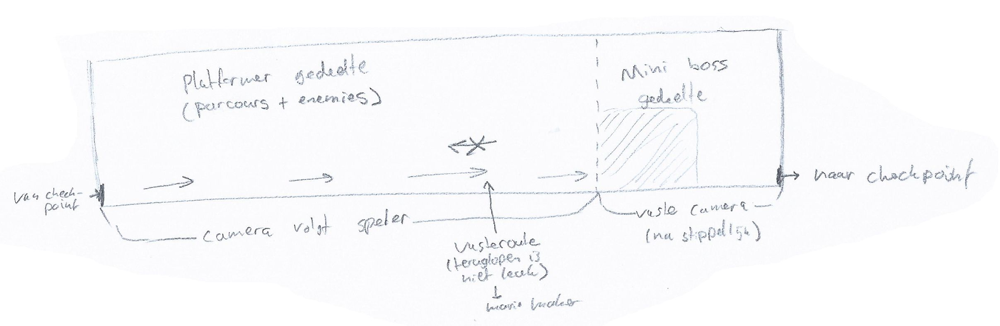
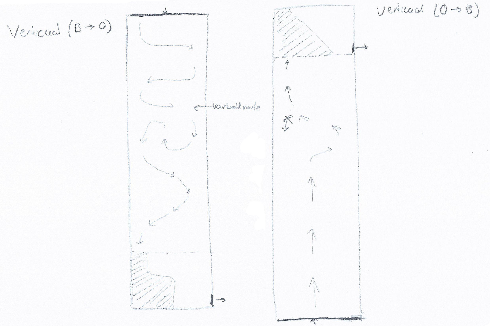
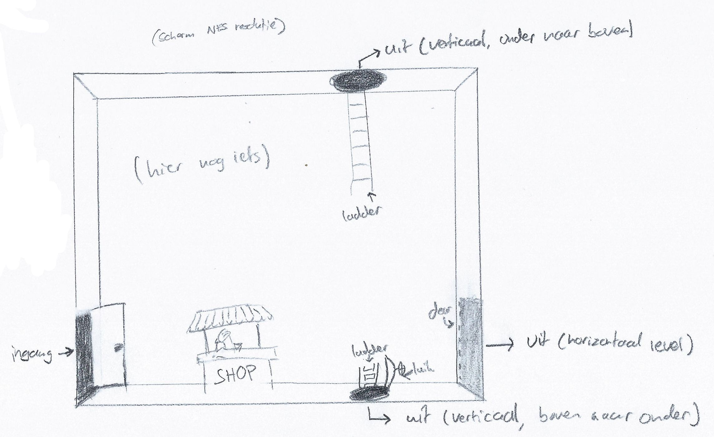
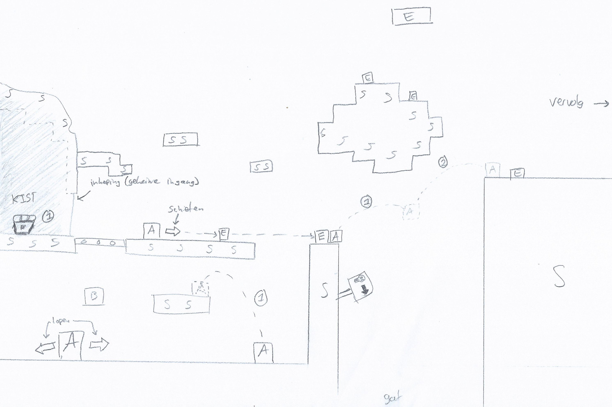
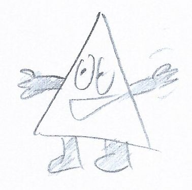

# concept (Niels)

I personally didn't have a massive idea for a game. I was thinking of a multiplayer shooter-type game with inspirations of tanks, asteroids, and Mario.

## USP
my unique selling point of the game is multiplayer. if you think that most of the grade is decided by which game is the most fun then I think a key part of that is multiplayer. having fun and playing together can make a game more easily fun.

## inspiration
As I said before comes my inspiration from a few games. the first one is tanks. It’s a shooter where you can play multiplayer and break the environment in a retro game. The second game that gave me inspiration is asteroids. the physics and shooting make this game interesting. Additionally, this game could also be multiplayer. Finally is Mario, Mario is mostly the storyline and the way it’s played. 

## technical challenges and gameplay
the technical challenges for my idea of a game are:
- storage
- art
- gameplay
- controlling the champions

### gameplay
the gameplay isn't really outlined but my idea works like this. where you have different levels each representing the difficulty of the level. for example, if a level begins light and turns darker indicating a boss monster is coming. the players have both guns they fire at enemies and bricks which can be destroyed. the key part of my idea is that multiplayer is key where you have to work together to defeat the monsters. Additionally, at some levels, both players need to stay at a certain position on a map to complete a level sort of like a puzzle to give it more difficulty.

# Concept tower destruction 2p (Frenk)

I had an idea to make a tower destruction game where 2 players compete against each other.

## usp
The unique selling point of this game is to compete against another player to get the highest score. Playing a game together with someone adds more fun in an arcade setting in my opinion. Furthermore to beat a other player in a game adds a next level of fun.

## inspiration
The inspiration of this game comes from angry birds and tanks (2d sideview). The tanks game is not the old top view version but rather the newer side-scroll type where you could only move left and right and then had to shoot with physics in mind. The adreline of just getting missed or not was very appealing to me. Furthermore, angry birds relies on the same physics mechanics and seeing a whole tower getting destroyed looks good.

## technische uitdagingen
The technical challenges for my idea of a game are:
- Physics
- Gameplay
- Scoring

## gameplay
The gameplay is as follows: 
There are 2 players on screen. 1 to the left and 1 to the right. The can both move left and right between some borders. 
In the middle there is a tower made of bricks or beams that are destructible. If this tower is below a certain height the tower grows again with a random pattern.
To score points you have to destroy as much as possible of the tower. It is also possible to hit the other player to steal points. The goal in the end is to score as many points in a certain amount of time. Some block in the tower have a special ability. If these are destroyed it can unlock a new weapon; gives rapid fire or affect the enemy with a status effect

# Concept (Loek)

## General gameplay

You play as a mage who has long lost his trusty wand. Having been separated
from your *twig* for some time, you've become proficient in the rapid use of
simple spells. You use these spells to defeat foes and minibosses that ward the
dangerous path you take to recover your *spell stick*. After battling your way
through all sorts of dangerous levels, you find your *incantation baton*, which
you then use to fight the final boss.

- Platformer (similar platformer mechanics to Cuphead)
- Focus on gameplay instead of story
- Medium length levels
- Horizontally (left to right), or vertically (both directions) scrolling
  levels
- Levels get progressively more difficult (like Hades)
- Each level has a miniboss at the end
- Levels are separated by a checkpoint room
- Checkpoints don't have respawn points, but are like saferooms with a shop for
  buying upgrades (like in Hades)
- The player automatically shoots bullets as they walk
- The player's score is determined by the distance travelled + bonus points for
  various actions like defeating enemies

## Player character & abilities

- Small guy with a hood and "Fall guys" eyes
- Actions
  - Jump (primary action button)
  - Dash/attack (secondary action button) (upgradable -> [shop][loek-shop])
  - Movement (D-pad)
  - Shooting (D-pad) (automatic rapid fire when holding direction)
- Temporarily invulnerable when taking damage (with flashing animation like in
  Super Mario Bros.)
- 5 HP (by default) (upgradable -> [shop][loek-shop])

## Level design

- Hatched zones in the following sketches indicate movement zones for the
  player during a mini boss
- Outside the movement zone, the player should take damage, but the player
  should realize this intuitively
- During the miniboss, the camera is locked past the dashed line so the player
  can't escape by running away
- The camera follows the player

### Level flow

- Horizontal level always flows from left to right
- Level design in which the player has to "walk back" from right to left is
  discouraged

- Vertical levels can either flow from top to bottom, or bottom to top
- Small sections of backtracking are allowed in the top to bottom vertical flow

[loek-shop]: #checkpoint-room-shop
### Checkpoint room (shop)

- Transition room between levels
- Visible exit point is determined by the following level type
  - Door on right side for horizontal level
  - Nuclear bunker style hatch for vertical top-bottom level
  - Ladder into black hole for vertical bottom-top level
- Game starting screen is also a checkpoint room, but without a shop
- Checkpoints don't act as reset points
- Available upgrades
  - HP boost
  - Temporary status effects
    - Jump boost
    - Speed boost
  - Different kinds of dashes (with tradeoffs)
    - Regular dash (furthest distace, no special effects)
    - Super punch (deals damage during dash, less distance)
    - Smoke bomb (temporarily invulnerable and invisible, less distance)
- Upgrades are purchased/unlocked only once per game
- Switching to other dashes is only allowed in checkpoints

### Regular level

- A: player
- B: breakable
- S: solid ground
- E: enemy
- 1: primary action
- 2: secondary action

In the above level, possible actions the player can perform are drawn using
dashed lines, with actions being indicated using the action button markers. The
levels are medium-difficulty platforming levels, with enemies that block the
way. The player can choose to take extra time to defeat all the enemies before
jumping to a platform, or to jump while shooting.

## Enemy types

The enemies aren't named in-game, so these names are either working names or
internal names. All enemies deal 1 HP damage per hit.

### Menneke

- Runs around and jumps on platforms vaguely in the player's direction
- Slightly slower than the player
- 1 HP
- Passive (damage on contact, but doesn't actively 'hunt' the player)
- Low score bonus

### Ventje

- Runs at the player, but can't jump very high
- Slightly slower than the player
- Passive
- 2 HP
- Divides into smaller copies when defeated (like slimes from Minecraft)
- Medium-low score bonus

### Terror uil

- Roams around the top of the screen
- Sometimes attacks player
- 1 HP
- Medium-high score bonus
- Was on NOS Jeugdjournaal once

## Later additions (converging)

- New Super Mario Bros. Wii-style co-op multiplayer (with ability to throw your
  friends) (Niels)
  - Shared HP between both players
  - Pick up other player by pressing secondary action button while standing
    still
  - Throw picked up player by pressing secondary action button again (also
    works while moving)
  - Easter eggs that are only reachable by throwing and dashing in sequence
    (Loek)
- The player character is a mage, instead of some random armed guy (Joshua)
- General storyline based on the idea that the player is a mage (Joshua) whose
  wand is lost (Loek)

## Technical implications

- Graphics
  - There needs to be at least a separate foreground layer and background layer
    to make sure enemies and interactive elements appear in the right order on
    screen
  - Not too many enemies can be on screen at once
  - Large levels need to be buffered and/or paged
  - Physically large minibosses require a lot of foreground sprites
  - **Screen wiping** transitions require hacky workarounds and/or lots of
    sprites to display properly (fix by using palette dimming transition)
- Processing power
  - Hitbox checking might need to be optimized using screen chunks due to the
    (possibly) large amount of on-screen enemies at once
  - Sound and GPU instructions will need to be streamed 'continuously', so the
    game loop can't take up 100% CPU time

