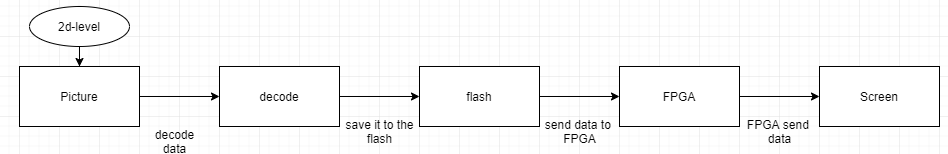
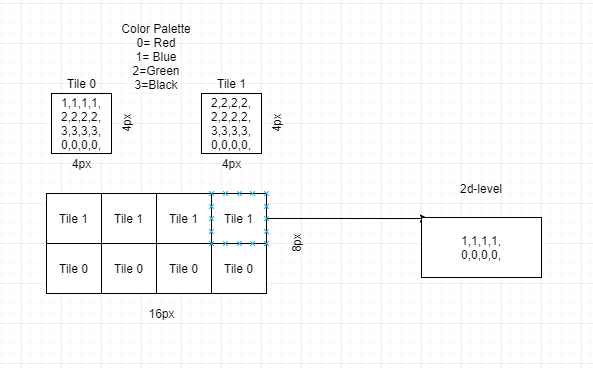
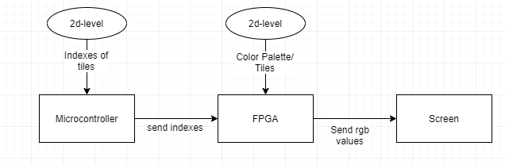

# Graphics

Even though the STM32 is a relatively powerful microcontroller, it will likely
not be fast enough for running game logic, sound logic and a graphics processor
on it's single CPU core. To minimize the risk of overloading the STM32
processor, all graphics processing and compositing will be outsourced to a
custom PPU implemented on the Basys 3 FPGA.

Because we're creating a sidescrolling 2D platformer, we don't need a very
complicated graphics processor. We also lack any knowledge about how
'real-world' graphics processors work, so we're basing our design on a product
closest to our target result, the NES.

## NES graphics

The NES has a separate coprocessor chip designed to generate video signals
called the RP2C02, which is manufactured by Ricoh. This chip has a lot of
features, some of which we don't need for our game. Here's a quick rundown of
this chip's features and limitations:

- composite output at 256x224 @ 60Hz (NTSC) or 256x240 @ 50Hz (PAL)
- 256 tiles per tilemap (with 8x8 tiles)
- 2 tilemaps (pattern tables)
- 4 palettes per sprite with 64 possible colors
- 512x480 background canvas with scrolling
- background scrolling splits
- 64 total sprites on screen (max 8 per scanline)
- sprites can be drawn before or after the background layer
- PPU control using DMA
- 8K character memory (tilemaps)
- 2K nametable memory (OAM for background tiles)
- 256B object attribute memory (OAM)
- tiles can be flipped using OAM
- no frame buffer

Though this chip is documented very well from a programmer's perspective, we
found very little documentation about any reverse-engineering of the chip's
actual hardware. While our PPU provides mostly the same features as the NES's
PPU, our design is entirely custom.

### Usage

The NES PPU has a lot of capabilities, so here's a quick run-down of how the
PPU is used by games to produce pictures.

On boot, the NES copies the contents of the so-called CHR-ROM (in game
cartridge) into the PPU's pattern tables. The NES has two 256-tile tilemaps
called the pattern tables which store all sprites in the game. By modifying the
nametable memory directly, the game can control which tile, and which palette
will be used for any given tile on the background layer. Because the background
layer only displays tiles in a fixed grid, the nametable memory area is not
very big.

The same process happens for the foreground sprites, though these can each be
positioned using screen coordinates, and don't have to conform to any grid. The
NES also has some limitations on how many sprites can be drawn and how many
palettes can be used. An important note is that the first color of any palette
used on any foreground sprite, is treated as the transparency color. Our PPU
also copies this behavior.

The following is a small section of pseudocode, depicting a program that will
display a triangle moving in a circle:

```c
unsigned frame = 0;

void setup() {
  // copy character rom to PPU
  memcpy(CHR, PPU->CHR, 0x8000);
  // character rom contains a sprite of a triangle at index 0

  // set palette index 0 to have 4 random colors
  PAL[0] = (palette) {
    PALETTE_COLOR_25,
    PALETTE_COLOR_F3,
    PALETTE_COLOR_00,
    PALETTE_COLOR_3D,
  };
  // copy palette data to PPU
  memcpy(PAL, PPU->PAL, 0x40);
}

void loop() {
  frame++; // increment frame counter

  OAM[0] = (sprite) {
    .x = sin(frame) * 20 + 10, // calculate circle position using frame counter
    .y = cos(frame) * 20 + 10, // calculate circle position using frame counter
    .pattern_index = 0, // triangle sprite
    .palette_index = 0, // palette 0 (see setup)
    .attributes = PPU_FX_FLIP_H | PPU_FX_FLIP_V, // flip horizontally and vertically
  };

  memcpy(OAM, PPU->OAM, 0x100); // update PPU with local copy of OAM
}

int main() {
  setup();
  while(1) loop();
}
```

[nesppuspecs]: https://www.copetti.org/writings/consoles/nes/
[nesppudocs]: https://www.nesdev.org/wiki/PPU_programmer_reference
[nesppupinout]: https://www.nesdev.org/wiki/PPU_pinout

# Generating audio signals

In order to generate sound for this project, a few possibilities exist (see chapters below)

## Sound chips

A sound chip is made to use digital, analog or mixed signals and produce a tone or sound based on that. 


| Manufacturer       | Chip                                                                                                          | Year | Channels | Stand-alone | Cost/availability |
| ------------------ | ------------------------------------------------------------------------------------------------------------- | ---- | -------- | ----------- | ----------------- |
| Atari, Inc.        | [POKEY](https://en.wikipedia.org/wiki/POKEY)                                                                  | 1979 | 4        | Somewhat    | N/A               |
| General Instrument | [AY-3-8910](https://en.wikipedia.org/wiki/AY-3-8910)                                                          | 1978 | 3        | Yes         | N/A               |
| General Instrument | [SP0250](https://en.wikipedia.org/wiki/General_Instrument_SP0256)                                             | 1981 | 1        | Yes         | N/A               |
| Konami             | [VRC6](https://en.wikipedia.org/wiki/VRC6)                                                                    | 1987 | 3        | Yes         | N/A               |
| Philips            | [Philips SAA1099](https://en.wikipedia.org/wiki/Philips_SAA1099 "Philips SAA1099")                            | 1984 | 6        | Yes         | N/A               |
| Sunsoft 5B         | [Sunsoft 5B](https://en.wikipedia.org/wiki/Memory_management_controller#FME-7 "Memory management controller") | 1992 | 3        | Yes?        | N/A               |
| Texas Instruments  | [SN76477](https://en.wikipedia.org/wiki/SN76477)                                                              | 1978 | 1        | Yes         | N/A               |
| Texas Instruments  | [SN76489](https://en.wikipedia.org/wiki/SN76489 "SN76489")                                                    | 1980 | 4        | Yes         | N/A               |
| Texas Instruments  | [Sega PSG (SN76496)](https://en.wikipedia.org/wiki/SN76496 "SN76496")                                         | 1982 | 4        | Yes         | N/A               | 

This chart shows different audio chips that might have been used in retro consoles. While all of them aren't easily available anymore it is still interesting to take a close look at how these IC's (Integrated Circuit) work. 

Most chips work on one of two crucibles, this being either a "Programmable sound generator" or "Sound Chip"


### Programmable sound generator (PSG)

PSG's are a subset of sound chips that generate sound based on a set of pre programmed tones they can generate. For example, this can be done by: modulating a input square wave to a different frequency and or amplitude.

### Pulse-code modulation

Pulse-code modulation uses pre-sampled data to generate sounds. This causes a lot more work for the engineer before gaining a working system. The flip side of that coin is that the Output can be of a better quality (depending on the sampled audio used).

## FPGA Circuit

In order to create an audio signal using the FPGA we can use PWM to emulate an analog signal on an output. This makes it so that in theory any signal that would have been produceable with a sound chip can also be made with the FPGA.


This figure shows an example signal (in blue), created by the FPGA. and the corresponding analog signal (in red).

It is useful to generate a few different types of signals like:
- triangle waves
- square waves
- sine waves
- sawtooth waves
- random noise 

# Level editing
For the project retro game-level design is an important part to make the game alive. That’s why research is needed to look for different ways of designing a retro game.
There are a lot of ways to make a 2d level but because where using an microcontroller and an FPGA the options are limited. That’s, why the first subject, is pictures. secondly, indexes and lastly software sources.

## Pictures 

If a level is made there is a possibility that it can be exported as a picture.
You can use that picture format and decode it in the microcontroller then send
it to the FPGA that sends that data through the VGA. the problem with this
method is that a lot of data is needed to save a whole level (640 * 480 pixels)
but different formats can have a large impact. For a better reference picture
below.



### PNG

PNG (Portable Network Graphics) is a lossless image compression format. Resulting in high-quality images that preserve all of the original data. Additionally, PNG supports a wider range of color depths, including 24-bit RGB and 32-bit RGBA (which includes an alpha channel for transparency), making it well-suited for images with a large number of colors or images that require transparency.

### BMP

BMP is a simple, uncompressed image format that provides good performance and easy access to pixel data. It's a good choice for applications where memory usage is not a concern and quick read times are important.

### TIFF

TIFF (Tagged Image File Format) is a flexible, adaptable file format for handling images and data within a single file, by including the header tags (size, definition, image-data arrangement, applied image compression) defining the image's geometry. TIFF supports a wide range of color depths, including black and white, grayscale, and full color (24-bit RGB and 32-bit RGBA), and is commonly used in printing, pre-press, desktop publishing, and professional photography. Unlike PNG, TIFF does not have built-in support for lossless compression and is typically used for high-quality, high-resolution images that need to be edited or processed in some way.

### TGA 

TGA is a lossless image format that supports a wide range of features, including alpha channels, gamma correction, and RLE compression. It's a good choice for applications where image quality is a priority and memory usage is not a concern.

### JPEG

JPEG (Joint Photographic Experts Group) is a commonly used image compression format that uses lossy compression to reduce the file size of digital images. It is well-suited for compressing photographic images and images with smooth color gradients, but may not perform as well with images that have sharp transitions or large areas of solid color. JPEG is widely used for images on the web, as well as for digital photos, because of its efficient compression and support for a wide range of color depths, including 8-bit grayscale and 24-bit RGB.

### Decode API

To make sure there is a way of decoding the picture data I found an API that could handle it. MagickCore API is a low-level interface between the C programming language and the ImageMagick image processing libraries. 
[imagemagick](https://imagemagick.org/script/magick-core.php "imagemagick")

### Conclusion
In conclusion do i think that BMP is the best choice. But there are a lot of ways for using a picture format in a project but our main problem with using pictures is that a lot of memory is needed to save the data. Additionally, the time to make a decode function could be significant and complicated because the color depth plays a big part and understanding the API can take a lot of time that’s why this option is not ideal.

## Indexes

Indexes is another way of using tiles and colors at a 2d level. With this method, you have a fixed color palette for example 4 colors and a fixed total of tiles. different tiles have numbers going from 0 to N meaning total tiles available and colors going from 0 to N. 



in the picture, you can have a better understanding of how indexes work.
### Data
the color palette is saved on the FPGA with the different tiles. While the microcontroller makes the levels and sends the indexed tiles to the FPGA.


### Conclusion

This method of creating levels splits the memory between the FPGA and the microcontroller. Additionally, the complexity behind the program is smaller while still giving a lot of freedom with level creation.

# Software sources

There are a lot of ways of creating tiles and sprites for pixel art. Underneath is a representation of my findings. For making 2d maps is Tiled the program that is going to be used in our project


| Name          | Link                                                             |Cost  |Level/pixel Art   |
|---------------|------------------------------------------------------------------|------|------------------|
| Tiled         | https://www.mapeditor.org/                                       |No    | level creation   |
| pyxeledit     | https://pyxeledit.com/about.php                                  |Yes   | level creation   |
| Pixel Mapper  | https://manual.avolites.com/docs/effects/pixel-mapper-examples/  |No    | level creation   |
| PixelPet      | https://github.com/Prof9/PixelPet                                |No    | level creation   |
| tilemap-studio| https://github.com/Rangi42/tilemap-studio                        |No    | level creation   |
| 10 pixel arts | https://blog.felgo.com/game-resources/make-pixel-art-online      |No    | pixel art        |
| piskel        | https://www.piskelapp.com/                                       |No    | pixel art        |
| GIMP          | https://www.gimp.org/downloads/thanks.html                       |No    | pixel art        |
| lospec        | https://apps.lospec.com/pixel-editor/                            |No    | pixel art        |
| Asesprite     | https://www.aseprite.org/                                        |Yes   | pixel art        |


# Input 

The playable character has 4 actions that it can perform:

-	horizontal movement
- aiming
-	jump 
-	ability / use

To control these actions there has to be at least 4 inputs. 
These can either be a button or joystick. 
The actions can be done as follows:

| Action | Button |	Joystick |
| ------ | ------ | -------- |
| Movement | 	x | x |
| Aiming | 	x | x |
| Jump |	x	 |  |
| Ability | 	x	|  |

## Handling

A joystick requires an analog input port.
A button can use either an analog or digital input port.
So the hardware needs to have both an analog input and a digital input, if a button and a joystick are used. 
The input can be handled by either the FPGA or microcontroller (STM32).
The microcontroller has the possibility to run multiple task simultaneously if needed.
The FPGA code contains multiple entities.
Data transfer between these entities takes at least one clock cycle.
If there are multiple entities the delay will increase and decreases the playability of the game.

## Conclusion

For gameplay reasons it is recommended to have the input handling as close as possible to the game logic unit.
This will decrease the delay between the user-input and onscreen gameplay. 

<!-- we're using DMA to control the PPU and APU (?) and this section seems non-specific to the controller and input communication
# Microcontroller FPGA communication

The hardware of the game consist out of a microcontroller(stm32) and a FPGA(basys3). The hardware components needs to communicate with each other. For this a protocol is needed.
See table 1 for a comparison of possible protocols:
| Protocol |	UART |	I2C	| SPI |
| -------- | ----- | ---- | --- |
|Number of lines |	1/2 |	2 |	4 |
|Duplex	| Half-duplex	| Half-duplex	| Full-duplex |
|Data transfer speed |	Upto 5mbps | Upto 3.4Mbps – 5Mbps	| Default at 50Mbps. Upto 100Mbps |
|Speed	| Slowest |	Faster than UART | Fastest |

There are only two devices that has to be connected. Complexity and master/slave amount are not relevant for this purpose. 
If there are multiple entities the delay will increase and decreases the playability of the game.

## Conclusion
It is recommended that SPI will be the communication protocol because of the data transfer speeds. The is a lot of data transfer between the microcontroller and FPGA.
-->
